# POC Scenario Contoso Finance #


## Abstract ##

## Learning Objectives ##
After completing this excerisize you will be able to:

- Understand containers and how to containerize your applications
- Build and Push container images to image repositories
- Deploy your images to all available Azure services

## Pre-Requisites ##
In order to complete this POC you will need:

- A **Microsoft Azure** subscription with (at least) contributor access.
- Have the **Hyper-V role** installed to your operating system. Have a look at [this guide](https://blogs.technet.microsoft.com/canitpro/2015/09/08/step-by-step-enabling-hyper-v-for-use-on-windows-10/) for help.
- Install latest version of **Visual Studio 2017 Enterprise** with following Workloads:
	- .NET desktop development
	- ASP.NET and web development
	- Azure development
	- Data storage and processing
- Download latest **SQL Server Management Studio** [here](https://docs.microsoft.com/en-us/sql/ssms/download-sql-server-management-studio-ssms)
- Download and install the latest **Docker Tools** from [here](https://docs.docker.com/docker-for-windows/install/)

## Table of Content ##
1. [Create an **Azure SQL DB** and publish database](https://github.com/Azure/fta-internalbusinessapps/blob/master/appmodernization/containers/articles/contoso-finance.md#create-an-azure-sql-db-and-publish-database)
2. [**Containerize** application](https://github.com/Azure/fta-internalbusinessapps/blob/master/appmodernization/containers/articles/contoso-finance.md#containerize-application)
3. [**Push Images** to Container Repository](https://github.com/Azure/fta-internalbusinessapps/blob/master/appmodernization/containers/articles/contoso-finance.md#push-images-to-a-container-repository)
	- Docker Hub
	- Private Azure Container Registry
4. [Deploy the application to **Azure Web Apps** from the above repositories](https://github.com/Azure/fta-internalbusinessapps/blob/master/appmodernization/containers/articles/contoso-finance.md#deploy-the-application-to-azure-web-apps)
5. [Deploy to IaaS **Linux VMs**](https://github.com/Azure/fta-internalbusinessapps/blob/master/appmodernization/containers/articles/contoso-finance.md#deploy-to-iaas-linux-vms) 
6. [Deploy to **Azure Container Instances** ACI](https://github.com/Azure/fta-internalbusinessapps/blob/master/appmodernization/containers/articles/contoso-finance.md#deploy-to-azure-container-instances-aci)
7. [Deploy to a **Kubernetes cluster**](https://github.com/Azure/fta-internalbusinessapps/blob/master/appmodernization/containers/articles/contoso-finance.md#deploy-to-a-kubernetes-cluster)
	- Use an ACS unmanaged cluster
	- Use an AKS managed kubernetes cluster
8. [Bonus scenario - **deploy database as a container** at the Kubernetes cluster](https://github.com/Azure/fta-internalbusinessapps/blob/master/appmodernization/containers/articles/contoso-finance.md#deploy-database-as-a-container-at-the-kubernetes-cluster)

## Create a new Resource Group ##
In this step we'll create a new [Resource Group](https://docs.microsoft.com/en-us/azure/azure-resource-manager/resource-group-overview#resource-groups) to host all of the resources needed for the project.

- Click on + **New**, type in **Resource Group** in the search area, press Enter.
- Click on **Resource Group**, click on **Create**.
- Enter a descriptive name (e.g. ContosoFinance-RG-WEurope) as the Resource group name.
- Select your **Subscription**.
- Select your **Resource Group Location** (e.g. West Europe).
- Click Create.


## Create an Azure SQL DB and publish database ##
* Click **+Add**, type in **SQL Database** in the search area, press **Enter** and click on **SQL Database**.
* Click **Create**.
* Enter **contosofinancedb** as the **Database Name**.
* For **Resource Group**, select **Use Existing**, then select the **Resource Group** created earlier (e.g. ContosoFinance-RG-WestUS2).
* For **Server**, click **Configure required settings**.
* Click **Create a new Server**.
* For **Server Name**, enter **contosofinancedbserver1**.
  * Note: The server name needs to be globally unique, so add a number to the end of name.
* Enter a **Server admin login** and **Password**.
  * Note: Save the **Login name** and **Password**, as you’ll need it later.
* For Location select the same location as before (e.g. **West Europe**).
* Click **Select** to save the server settings.

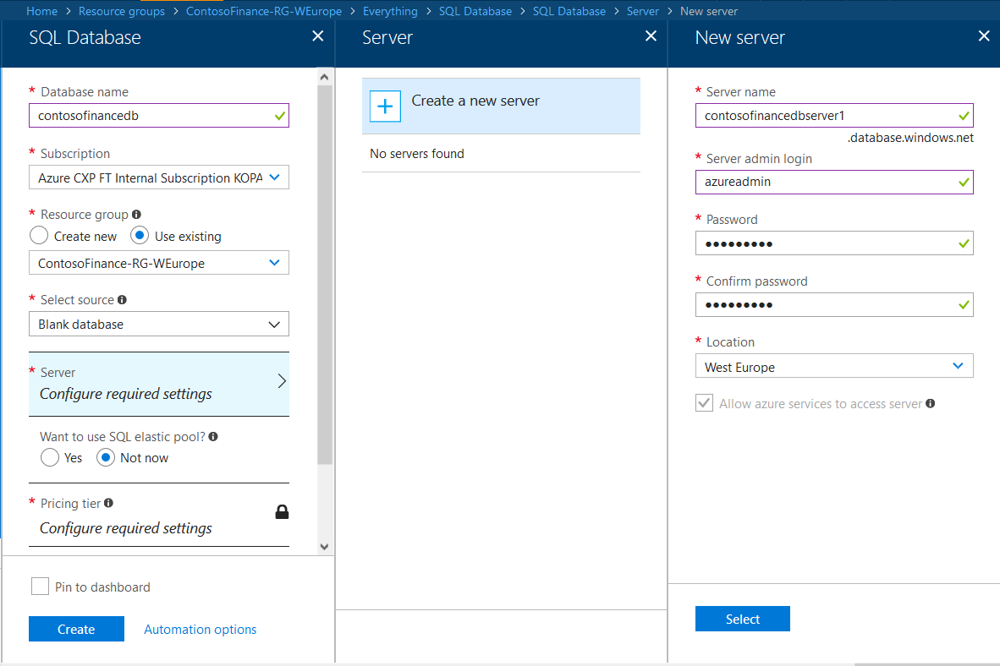

* Click on **Pricing Tier**.
* Move the **DTU** slider to **20**.
  * Note: DTU's are Database Transaction Units and measure database performance with a blended measure of CPU, memory, I/O.  For more information on DTU's, see [Explaining Database Transaction Units](https://docs.microsoft.com/en-us/azure/sql-database/sql-database-what-is-a-dtu).
* Move the **Storage** slider to **5GB**.
* Click **Apply**.
* Click **Create** to create a new SQL Database Server & Database.

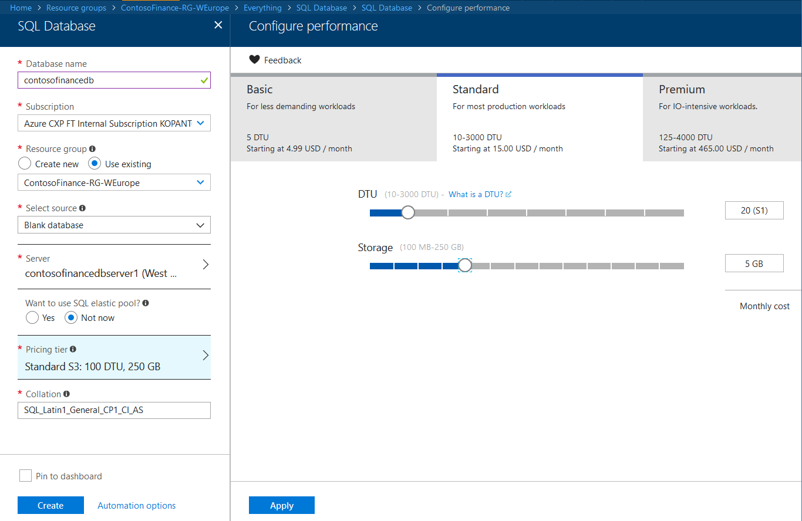

  * Note: The Azure alert bell will indicate that the deployment is in progress.

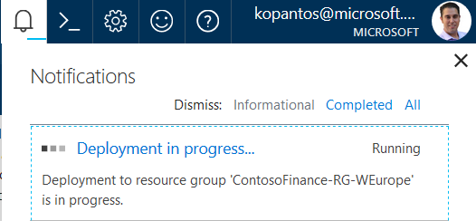

## Client IP in Firewall Settings for SQL Server
To add the **IP address** of the client you access the database from, do the following steps:

* Under the SQL Server Settings, click on **Firewall**.
* Click on **Add client IP** and click **Save**. This will add your current IP as a new rule on the Firewall.

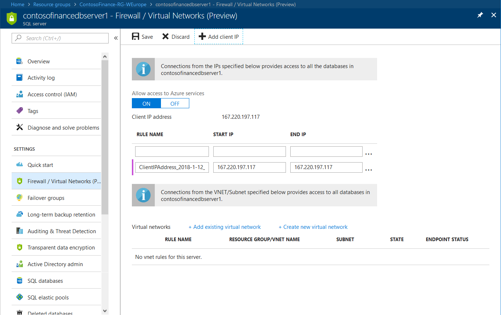

## Publish the Database into Azure SQL DB

- Open the database that was created and from the overview section copy the server name.
- Open SSMS (Sql Server Management Studio) and connect to the Azure server that was created.

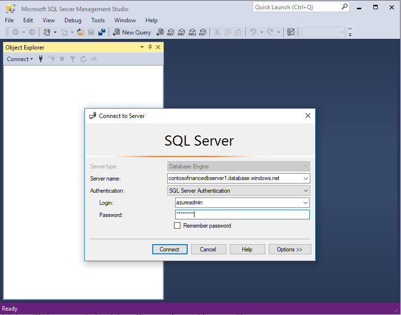

- Download the project from [this url](https://github.com/Azure/fta-internalbusinessapps/blob/master/appmodernization/containers/Contoso-Finance.zip), extract the zip file to a directory.
- With the contosofinancedb selected in SSMS click File and then open file from the menu bar, navigate to the path that the archive files were extracted and then open the `Database\Scripts\create.sql` file.
- Execute the script and confirm that the script executed succesfully and that the tables were created.

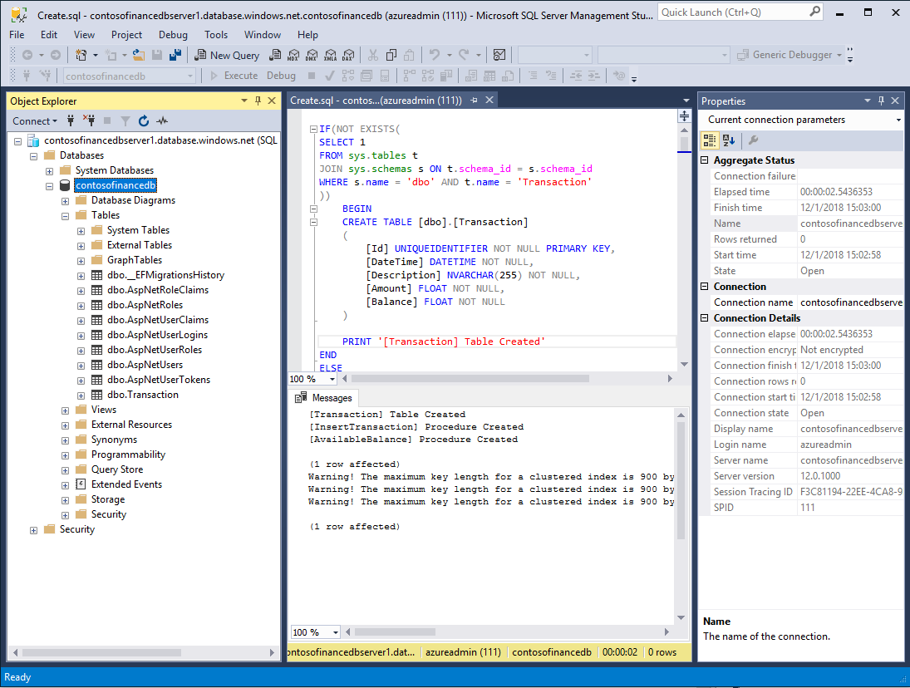

## Containerize Application ##
- Run Docker Tools for windows. You can access a complete guide on how to start the tools [here](https://docs.docker.com/docker-for-windows/install/#start-docker-for-windows "Start Docker Tools for Windows")
- Start Visual Studio 2017 and open the `Contoso.Financial.Core.sln` file from the folder that the archive was extracted to. Once the solution has loaded, you should be able to see 3 projects in the solution explorer 

    	Contoso.Financial.Core.Api
    	Contoso.Financial.Core.Background
    	Contoso.Financial.Core.Website

- From the Build menu item select build solution and make sure that the solution builds without errors.
- Next right click on each project and select `Add > Docker Support`. In the popup window that will appear select Linux and click Ok. 

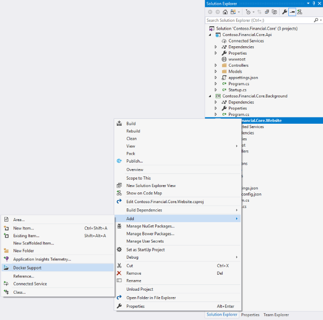

This will create a new project in the solution named **docker-compose** that will contain several files and a new file named **Dockerfile** in each project. These files are used by the docker tools to describe the containers and services that are going to be build.

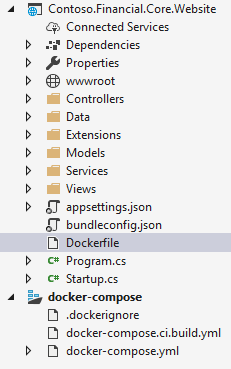

**Note**: Running the above command will actually go ahead and build the images and containers locally. You will need to clear up your environment. To achieve that open a new Powershell window and type in the following commands to clean up everything

    docker rm -f $(docker ps -a -q)
    
    docker rmi -f $(docker images -q)

- Next you will have to configure the application with all the necessary configuration settings needed to run. To achieve that you will have to use Environment Variables. Open the docker-compose-override.yml file from the docker-compose solution project and type in the information missing.


```
version: '3'

services:
  contoso.financial.core.background:
    environment:
      - TransactionDb=Server=tcp:Server=tcp:contosofinancedbserver1.database.windows.net,1433;Initial Catalog=contosofinancedb;Persist Security Info=False;User ID={your_username};Password={your_password};MultipleActiveResultSets=False;Encrypt=True;TrustServerCertificate=False;Connection Timeout=30;


  contoso.financial.core.website:
    environment:
      - ASPNETCORE_ENVIRONMENT=Development
      - IdentityConnection=Server=tcp:contosofinancedbserver1.database.windows.net,1433;Initial Catalog=contosofinancedb;Persist Security Info=False;User ID={your_username};Password={your_password};MultipleActiveResultSets=False;Encrypt=True;TrustServerCertificate=False;Connection Timeout=30;
      - APIServer=localhost:32770
    ports:
      - "80"


  contoso.financial.core.api:
    environment:
      - ASPNETCORE_ENVIRONMENT=Development
      - TransactionDb=Server=tcp:contosofinancedbserver1.database.windows.net,1433;Initial Catalog=contosofinancedb;Persist Security Info=False;User ID={your_username};Password={your_password};MultipleActiveResultSets=False;Encrypt=True;TrustServerCertificate=False;Connection Timeout=30;
    ports:
      - "32770:80"


```

You will have to specify the database connection string as well as the API server to be used by the web site. You can copy the connection string from the Azure portal by opening the database that was provisioned and navigating to the connection strings blade as shown in the following image.

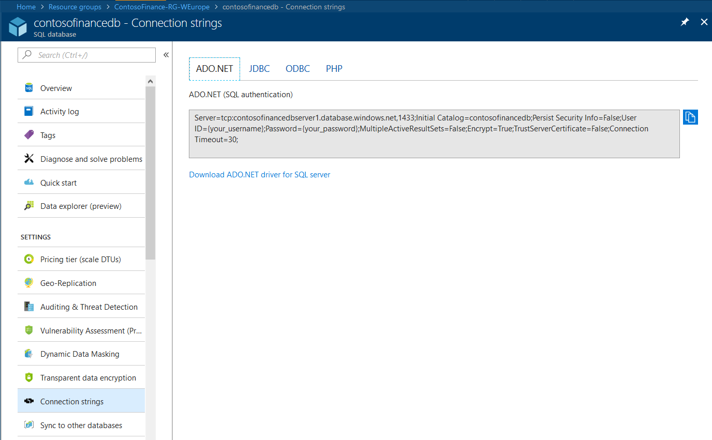

**Note**: For security reasons, the connection string does not contain the username and password for connecting with the database. You will have to update the connection string with the username and password you have given when provisioning the databse, once the connection string is copied in the `docker-compose-override.yml` file.

- Your solution is now ready to run locally. You can test it by clicking the debug button in Visual Studio. This will build the images, create and run three container instances for each one of the three projects in the solution. Once the process completes your browser should popup showing the login screen of the contoso Finance application.
- Use the register as new user to create a new identity and login to the application.

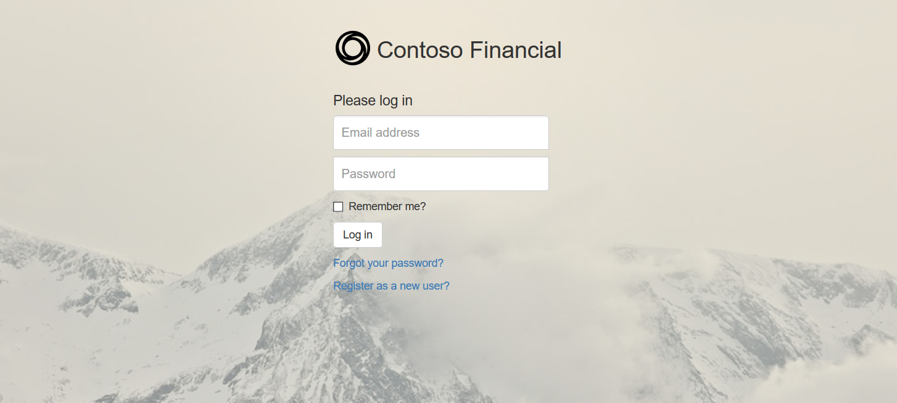

- After loging in, if everyhting is working correctly you will be able to see the home screen of the Financial application and the transactions that have been issued till that time.


- Stop debugging your application. And clean your visual studio solution. This will stop and remove all running container instances.

## Push Images to a Container Repository ##
Now that our solution is containerized and is working, it's time to push the images to a container registry so that you can deploy the application. 

- First you will need to build a release version of the container images. To achieve that switch your visual studio environment from debug to release and Build your solution. This will generate the final images that will be taged with the keyword latest as shown in the following image.


- Next you will have to tag these images with the namespace you are going to be using in the container registries. To do that you will have to issue the following commands in the powershell window.

```
docker tag contoso.financial.core.background kpantos/contoso.financial.core.background
docker tag contoso.financial.core.website kpantos/contoso.financial.core.website
docker tag contoso.financial.core.api kpantos/contoso.financial.core.api
```

**A. Pushing to Docker Hub**
Docker Hub is a cloud-based registry service which allows you to link to code repositories, build your images and test them, stores manually pushed images, and links to Docker Cloud so you can deploy images to your hosts. It provides a centralized resource for container image discovery, distribution and change management, user and team collaboration, and workflow automation throughout the development pipeline.

In order to be able to push the images to Docker Hub you will need to have an account with Docker. If you don't then you can create a new one at [https://hub.docker.com/](https://hub.docker.com/ "Docker Hub") 


**Note**: The Docker Hub Registry is free to use for public repositories. Plans with private repositories are available though, and in different sizes. You can get more information regarding available docker hub repositories from [Billing Information & Pricing Plans](https://hub.docker.com/account/billing-plans/).

Once you've created an account with docker then you can push the images that were created previously. To achieve that from the powershell window, first login with:

``` docker login --username yourusername --password yourpassword ```

and then push each image to docker hub.

```
docker push kpantos/contoso.financial.core.background
docker push kpantos/contoso.financial.core.website
docker push kpantos/contoso.financial.core.api
```

once the process is complete you should be able to see the 3 different containers at docker hub


**B. Pushing to Azure Container Registry**
Azure Container Registry is a managed Docker registry service based on the open-source Docker Registry 2.0. Create and maintain Azure container registries to store and manage your private Docker container images. Use container registries in Azure with your existing container development and deployment pipelines, and draw on the body of Docker community expertise.

To create an Azure Container Registry Select New > Containers > Azure Container Registry.


Enter values for Registry name (e.g ftacontainersacr01) and Resource group. The **registry name must be unique within Azure**, and contain 5-50 alphanumeric characters. Select your resource group named `ContosoFinance-RG-WEurope`, and for SKU, select 'Basic'. Select Create to deploy the ACR instance.

When the Deployment succeeds a message appears, select the container registry in the portal, then select Access keys.

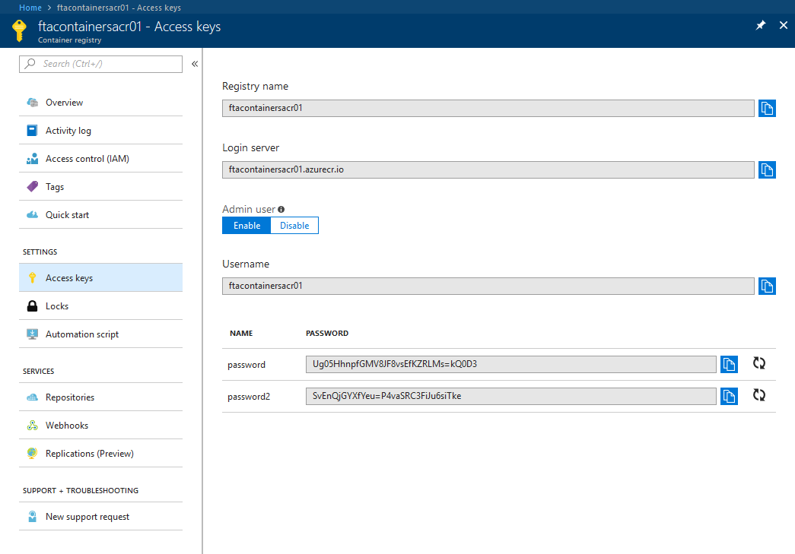

Under **Admin user**, select **Enable**. Take note of the following values:

- Login server
- Username
- password

Use the powershell window to login to ACR. To do so, use the docker login command. Replace the *username*, *password*, and login server values with those you noted in the previous step.

```docker login --username <username> --password <password> <login server>```

The command returns Login Succeeded once completed.

To push your images to your newly created Azure Container Registry run the following commands to from the powershell window replacing the login server name with the one that you've given.

```
-- images have to exist localy to be pushed to the repository
docker tag contoso.financial.core.background ftacontainersacr01.azurecr.io/contoso.financial.core.background
docker tag contoso.financial.core.website ftacontainersacr01.azurecr.io/contoso.financial.core.website
docker tag contoso.financial.core.api ftacontainersacr01.azurecr.io/contoso.financial.core.api

docker push <login server>/contoso.financial.core.background
docker push <login server>/contoso.financial.core.website
docker push <login server>/contoso.financial.core.api
```
To list the images in your ACR instance, navigate to your registry in the portal and select Repositories, then select the repositories you created with docker push.

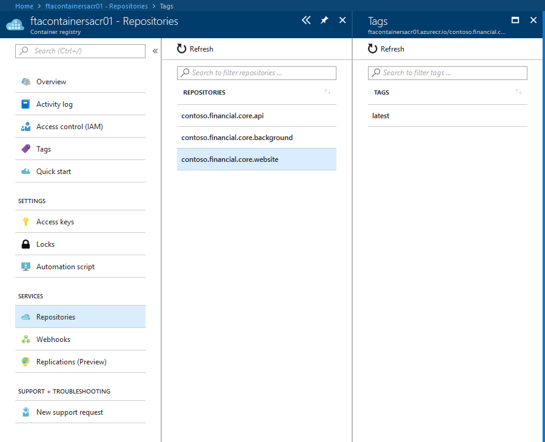

## Deploy the application to Azure Web Apps ##
You can host Linux container based applications in the cloud by using Azure Web Apps. To create a Web App for Containers using your custom containers, Select New > Containers > Web App for Containers.

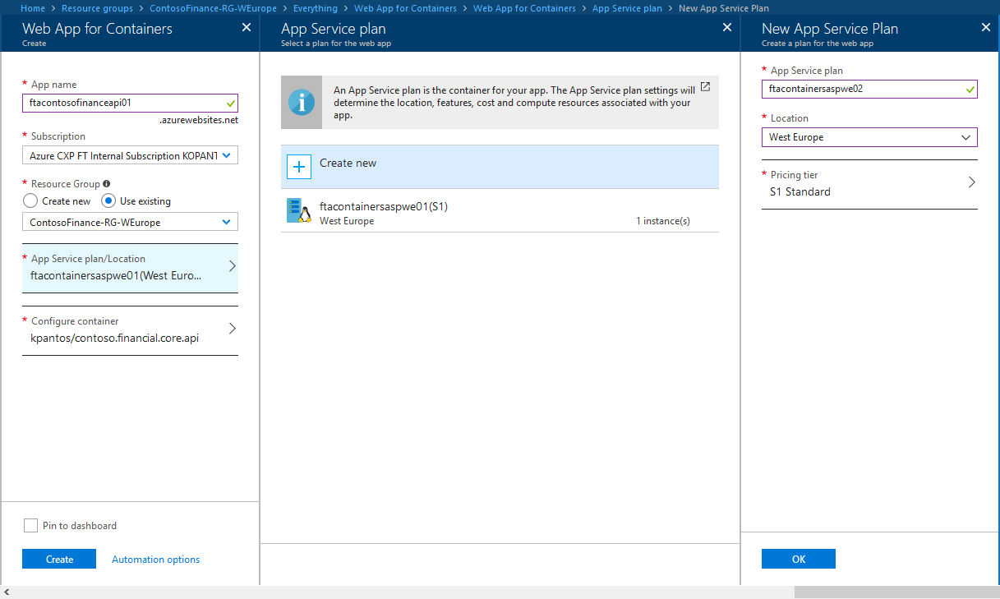

- Enter values for the web app name (e.g ftacontosofinanceapi01) and select the **ContosoFinance-RG-WEurope** Resource group that you created. The **web app name must be a unique resource identifier**. 
- Select **Linux** for Operating system.
- Create a new App Service plan to host the services by clicking on App Service Plan/Location and clicking the Create New button. Give a name for the service plan (e.g. ftacontainersaspwe01), select the S1 Standard pricing tier and click ok.
- Configure the container to run by clicking Configure container and typing in the container image name to be pulled from the DockerHub registry e.g. `kpantos/contoso.financial.core.api`.
**Note:** Private docker hub registry requires username and password. 
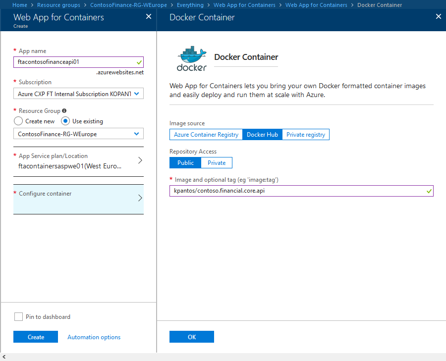 
You can also opt-in to pull an image and run a container instance from an Azure Container Registry. To achive that select the Azure Container Registry image source and select from an already provisioned registry the image to run.
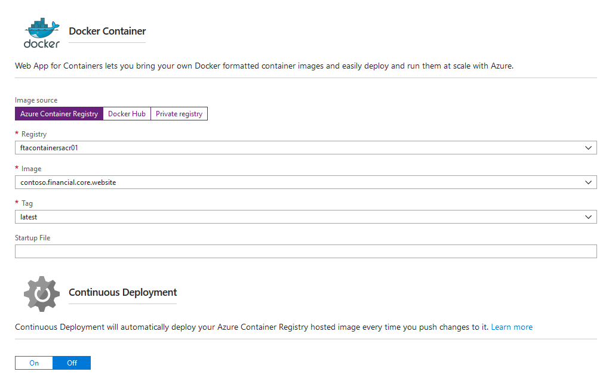
- Click ok and then Create. When the Deployment succeeds a message appears, select the newly created web app in the portal, and then select Application Settings to configure the application using Environment Variables.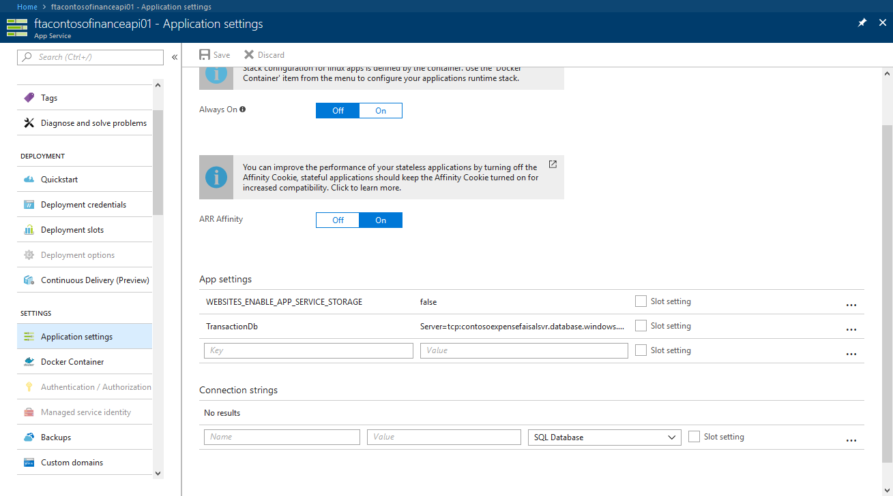 
`kpantos/contoso.financial.core.api` container requires the database connection string for the transactions database. So in Application settings itroduce a new App setting key named `TransactionDb` giving the connection string as value e.g. (`Server=tcp:contosofinancedbserver1.database.windows.net,1433;Initial Catalog=contosofinancedb;Persist Security Info=False;User ID={your_username};Password={your_password};MultipleActiveResultSets=False;Encrypt=True;TrustServerCertificate=False;Connection Timeout=30;`)
**note:** don't forget to change the username and password.
- Finally test that your API is working by navigating to it at https://ftacontosofinanceapi01.azurewebsites.net/swagger and trying the Balance API method.
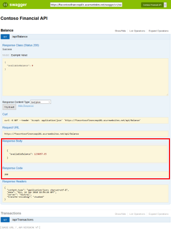 
- Follow the same steps to deploy the website image to a new Web App and connect to the API server.
	- use the same App Service Plan
	- Configure the Website with the following App Settings
```
APIServer=ftacontosofinanceapi01.azurewebsites.net
IdentityConnection=Server=tcp:contosofinancedbserver1.database.windows.net,1433;Initial Catalog=contosofinancedb;Persist Security Info=False;User ID={your_username};Password={your_password};MultipleActiveResultSets=False;Encrypt=True;TrustServerCertificate=False;Connection Timeout=30;
```
- Test the website by using the URI provided by the new Web App. After loging in, if everyhting is working correctly you will be able to see the home screen of the Financial application and the transactions that have been issued till that time.

**Note**: Azure App Services is granting SSH port access to the Kudu infrastructure which we tunnel through so that we can inspect and debug our containers hosted in the Azure App Service for Containers service. Unfortunatelly SSH server is not running by default in these Docker images. So if you need to debug the running containers you can either configure ssh server to run with the container or use just download the current docker log files https://ftacontosofinanceweb01.scm.azurewebsites.net/api/logs/docker/zip. 

## Deploy to IaaS Linux VMs ##
You can host Linux container based applications in the cloud by using Linux VMs. To run the contoso financial application in a linux virtual machine, start by provisioning a new Ubuntu vm on Azure following this guide https://docs.microsoft.com/en-us/azure/virtual-machines/linux/quick-create-portal. 
- When the Deployment succeeds connect to your Linux virtual machine using SSH, use the following command: `ssh adminusername@<ip of the vm>`.
-  Add the GPG key for the official Docker repository to the system:
```
curl -fsSL https://download.docker.com/linux/ubuntu/gpg | sudo apt-key add -
```
- Add the Docker repository to APT sources:
```
sudo add-apt-repository "deb [arch=amd64] https://download.docker.com/linux/ubuntu $(lsb_release -cs) stable"
```
- Next, update the package database with the Docker packages from the newly added repo:
```
sudo apt-get update
```
- Make sure you are about to install from the Docker repo instead of the default Ubuntu 16.04 repo:
```
apt-cache policy docker-ce
```
  the output should look like:
```
docker-ce:
  Installed: (none)
  Candidate: 17.03.1~ce-0~ubuntu-xenial
  Version table:
     17.03.1~ce-0~ubuntu-xenial 500
        500 https://download.docker.com/linux/ubuntu xenial/stable amd64 Packages
     17.03.0~ce-0~ubuntu-xenial 500
        500 https://download.docker.com/linux/ubuntu xenial/stable amd64 Packages

  ```
  Notice that docker-ce is not installed, but the candidate for installation is from the Docker repository for Ubuntu 16.04. The docker-ce version number might be different.
- Finally install Docker
```
sudo apt-get install -y docker-ce
```
Docker should now be installed, the daemon started, and the process enabled to start on boot. Check that it's running:
```
sudo systemctl status docker
```
The output should be similar to the following, showing that the service is active and running:

```
docker.service - Docker Application Container Engine
   Loaded: loaded (/lib/systemd/system/docker.service; enabled; vendor preset: enabled)
   Active: active (running) since Sun 2016-05-01 06:53:52 CDT; 1 weeks 3 days ago
     Docs: https://docs.docker.com
 Main PID: 749 (docker)
```
- Check the [current version](https://github.com/docker/compose/releases) for docker compose and install the latest release with the following command:
```
sudo curl -L https://github.com/docker/compose/releases/download/1.18.0/docker-compose-`uname -s`-`uname -m` -o /usr/local/bin/docker-compose
```
  Change permissions to docker-compose
```
sudo chmod +x /usr/local/bin/docker-compose
```
  and verify that the installation was successful 
```
sudo docker-compose --version
Output
docker-compose version 1.18.0, build 8dd22a9
```
- Create a new yml service definition file for the finance services by running : `nano finance.yml`. In the finance.yml file paste the following code:
```
version: '3'
services:
  contoso.financial.core.background:
    image: kpantos/contoso.financial.core.background
    environment:
      - TransactionDb=Server=tcp:contosofinancedbserver1.database.windows.net,1433;Initial Catalog=contosofinancedb;Persist Security Info=False;User ID=azureadmin;Password=f00b@r12.;MultipleActiveResultSets=False;Encrypt=True;TrustServerCertificate=False;Connection Timeout=30;

  contoso.financial.core.website:
    image: kpantos/contoso.financial.core.website
    environment:
      - ASPNETCORE_ENVIRONMENT=Development
      - IdentityConnection=Server=tcp:contosofinancedbserver1.database.windows.net,1433;Initial Catalog=contosofinancedb;Persist Security Info=False;User ID=azureadmin;Password=f00b@r12.;MultipleActiveResultSets=False;Encrypt=True;TrustServerCertificate=False;Connection Timeout=30;
      - APIServer=<IP of the server>:8080
    ports:
      - "80:80"

  contoso.financial.core.api:
    image: kpantos/contoso.financial.core.api
    environment:
      - ASPNETCORE_ENVIRONMENT=Development
      - TransactionDb=Server=tcp:contosofinancedbserver1.database.windows.net,1433;Initial Catalog=contosofinancedb;Persist Security Info=False;User ID=azureadmin;Password=f00b@r12.;MultipleActiveResultSets=False;Encrypt=True;TrustServerCertificate=False;Connection Timeout=30;
    ports:
      - "8080:80"
```
- Open ports 80 and 8080 at the Virtual machine NSG (Network security group). For a detailed guide on how to do that navigate to https://docs.microsoft.com/en-us/azure/virtual-machines/windows/nsg-quickstart-portal.
- Pull the images and start them up with the following command:
```
sudo docker-compose -f finance.yml up
```
- Copy the public IP address that was assigned to the Virtual machine by navigating to the Virtual Machine overview blade in the Azure portal.

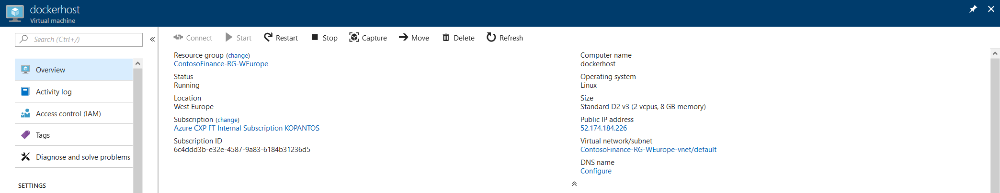

- Test the website by using the IP copied and navigating to `http://<IP address>`. After loging in, if everyhting is working correctly you will be able to see the home screen of the Financial application and the transactions that have been issued till that time.

## Deploy to Azure Container Instances (ACI) ##
Azure Container Instances offers the fastest and simplest way to run containers in Azure, without having to provision any virtual machines and without having to adopt a higher-level service.
To create the container instances you will need to use **Azure Cloud Shell** as our containers need a few environment variables to run and the portal currently does not support specifying env variables when provisioning new instances.

The Azure Cloud Shell is a free interactive shell that you can use to run the steps in this article. It has common Azure tools preinstalled and configured to use with your account. 

To launch the Cloud Shell click the Cloud Shell button on the menu in the upper right of the Azure portal.


- In Cloud shell type in the following command
```
az container create --resource-group ContosoFinance-RG-WEurope --name contoso-finance-api --image kpantos/contoso.financial.core.api --restart-policy OnFailure --ip-address public --ports 80 --environment-variables TransactionDb="Server=tcp:contosofinancedbserver1.database.windows.net,1433;Initial Catalog=contosofinancedb;Persist Security Info=False;User ID=<your username>;Password=<your password>.;MultipleActiveResultSets=False;Encrypt=True;TrustServerCertificate=False;Connection Timeout=30;"
```
Within a few seconds, you should get a response to your request. Initially, the container is in the Creating state, but it should start within a few seconds. You can check the status using the [az container show](https://docs.microsoft.com/en-us/cli/azure/container?view=azure-cli-latest#az_container_show) command:
```
az container show --resource-group ContosoFinance-RG-WEurope --name contoso-finance-api
```
At the bottom of the output, you will see the container's provisioning state and its IP address:
```
...
"ipAddress": {
      "ip": "13.88.176.27",
      "ports": [
        {
          "port": 80,
          "protocol": "TCP"
        }
      ]
    },
    "osType": "Linux",
    "provisioningState": "Succeeded"
...
```
- Follow the same steps omiting the public IP for the background container instance
```
az container create --resource-group ContosoFinance-RG-WEurope --name contoso-finance-background --image kpantos/contoso.financial.core.background --restart-policy OnFailure --environment-variables TransactionDb="Server=tcp:contosofinancedbserver1.database.windows.net,1433;Initial Catalog=contosofinancedb;Persist Security Info=False;User ID=<your username>;Password=<your password>;MultipleActiveResultSets=False;Encrypt=True;TrustServerCertificate=False;Connection Timeout=30;"
```
- For the website container instance type in the following command **changing the IP address to the IP that the API container instance is assigned**.
```
az container create --resource-group ContosoFinance-RG-WEurope --name contoso-finance-web --image kpantos/contoso.financial.core.website --restart-policy OnFailure --ip-address public --ports 80 --environment-variables APIServer=<THE_IP_OF_THE_OTHER_CONTAINER> IdentityConnection="Server=tcp:contosofinancedbserver1.database.windows.net,1433;Initial Catalog=contosofinancedb;Persist Security Info=False;User ID=<your username>;Password=<your password>;MultipleActiveResultSets=False;Encrypt=True;TrustServerCertificate=False;Connection Timeout=30;"
```
**Note**: You will have to update the connection strings specified in the previous examples with the username and password you have specified for your Azure database.

- Test the website by assigned to the website container and navigating to `http://<IP address>`. After loging in, if everyhting is working correctly you will be able to see the home screen of the Financial application and the transactions that have been issued till that time.

## Deploy to a Kubernetes cluster ##
Azure offers two different services that allow to run a Kubernetes cluster.

Azure Container Service (ACS) allows you to quickly deploy a production ready Kubernetes, DC/OS, or Docker Swarm cluster.

Azure Container Service (AKS) makes it simple to create, configure, and manage a cluster of virtual machines that are preconfigured to run containerized applications. AKS reduces the complexity and operational overhead of managing a Kubernetes cluster by offloading much of that responsibility to Azure.

Both Azure Services offer the same Orchestration capabilities through Kubernetes orchestrator. Azure Container Service (AKS) is being updated though, to add new deployment options, enhanced management capabilities, and cost benefit to Kubernetes on Azure. This POC will run equally well on whichever solution you deploy. You can use the following guides to help you provision a new kubernetes cluster on Azure.

- [ACS Kuberetes cluster creation walktrough](https://docs.microsoft.com/en-us/azure/container-service/kubernetes/container-service-kubernetes-walkthrough)
- [AKS kubernetes cluster createion walkthrough](https://docs.microsoft.com/en-us/azure/aks/kubernetes-walkthrough)

In this POC, an AKS cluster is deployed using the Azure CLI and Azure Cloud Shell. A multi-container application consisting of the web front end, an API and a Background service instance is then run on the cluster. Once completed, the application is accessible over the internet.
To launch the Cloud Shell click the Cloud Shell button on the menu in the upper right of the Azure portal.


- While AKS is in preview, creating new clusters requires a feature flag on your subscription. You may request this feature for any number of subscriptions that you would like to use. Use the `az provider register` command to register the AKS provider:
```
az provider register -n Microsoft.ContainerService
```

- Create a cluster named contosoFinanceK8sCluster with three nodes.
```
az aks create --resource-group ContosoFinance-RG-WEurope --name contosoFinanceK8sCluster --node-count 3 --generate-ssh-keys
```
- Connect to the cluster. To manage a Kubernetes cluster we use kubectl, the Kubernetes command-line client. If you're using Azure Cloud Shell, kubectl is already installed. So to connect you will need to configure kubectl to connect to your Kubernetes cluster, run the following command. This step downloads credentials and configures the Kubernetes CLI to use them.
```
az aks get-credentials --resource-group ContosoFinance-RG-WEurope --name contosoFinanceK8sCluster
```
- Verify the connection to your cluster by using the kubectl get command to return a list of the cluster nodes.
```
kubectl get nodes
====
output
NAME                       STATUS    ROLES     AGE       VERSION
aks-nodepool1-35295694-0   Ready     agent     1m        v1.7.7
aks-nodepool1-35295694-1   Ready     agent     1m        v1.7.7
aks-nodepool1-35295694-2   Ready     agent     1m        v1.7.7
```

- Deploy and run the application
A Kubernetes manifest file defines a desired state for the cluster, including what container images should be running. For this example, manifests are used to create all objects needed to run the Azure Contoso Finance application.

 Create a file named contoso-finance-api.yaml and copy into it the following YAML code. If you are working in Azure Cloud Shell, this file can be created using vi or Nano as if working on a virtual or physical system.

**contoso-finance-api.yaml**
```
apiVersion: apps/v1beta1
kind: Deployment
metadata:
  name: contoso-finance-api
spec:
  replicas: 1
  template:
    metadata:
      labels:
        app: contoso-finance-api
    spec:
      containers:
      - name: contoso-finance-api
        image: kpantos/contoso.financial.core.api
        ports:
        - containerPort: 80
        env:
        - name: TransactionDb
          value: "Server=tcp:contosofinancedbserver1.database.windows.net,1433;Initial Catalog=contosofinancedb;Persist Security Info=False;User ID=azureadmin;Password=f00b@r12.;MultipleActiveResultSets=False;Encrypt=True;TrustServerCertificate=False;Connection Timeout=30;"
---
apiVersion: v1
kind: Service
metadata:
  name: contoso-finance-api
spec:
  type: LoadBalancer
  ports:
  - port: 80
  selector:
    app: contoso-finance-api
---
```

- Create and run the API
```
kubectl create -f contoso-finance-api.yaml
====
output
deployment "contoso-finance-api" created
service "contoso-finance-api" created
```
-Test the API. As the application is run, a Kubernetes service is created that exposes the application front end to the internet. This process can take a few minutes to complete.
To monitor progress, use the kubectl get service command with the --watch argument.
```
kubectl get service contoso-finance-api --watch
```
Initially the EXTERNAL-IP for the contoso-finance-api service appears as pending.
```
NAME                  TYPE           CLUSTER-IP     EXTERNAL-IP   PORT(S)        AGE
contoso-finance-api   LoadBalancer   10.0.214.183   <pending>     80:30608/TCP   34s
```
Once the EXTERNAL-IP address has changed from pending to an IP address, use CTRL-C to stop the kubectl watch process.
```
NAME                  TYPE           CLUSTER-IP     EXTERNAL-IP    PORT(S)        AGE
contoso-finance-api   LoadBalancer   10.0.214.183   13.81.203.49   80:30608/TCP   2m
```
Copy the external IP as this is going to be used as the APIServer setting in the next section.

-  Create a file named contoso-finance.yaml and copy into it the following YAML code.

**contoso-finance.yaml**
```
apiVersion: apps/v1beta1
kind: Deployment
metadata:
  name: contoso-finance-web
spec:
  replicas: 1
  template:
    metadata:
      labels:
        app: contoso-finance-web
    spec:
      containers:
      - name: contoso-finance-web
        image: kpantos/contoso.financial.core.website
        ports:
        - containerPort: 80
        env:
        - name: IdentityConnection
          value: "Server=tcp:contosofinancedbserver1.database.windows.net,1433;Initial Catalog=contosofinancedb;Persist Security Info=False;User ID=azureadmin;Password=f00b@r12.;MultipleActiveResultSets=False;Encrypt=True;TrustServerCertificate=False;Connection Timeout=30;"
        - name: APIServer
          value: "REPLACE WITH THE IP YOU COPIED EARLIER"
---
apiVersion: v1
kind: Service
metadata:
  name: contoso-finance-web
spec:
  type: LoadBalancer
  ports:
  - port: 80
  selector:
    app: contoso-finance-web
---
apiVersion: apps/v1beta1
kind: Deployment
metadata:
  name: contoso-finance-background
spec:
  replicas: 1
  template:
    metadata:
      labels:
        app: contoso-finance-background
    spec:
      containers:
      - name: contoso-finance-background
        image: kpantos/contoso.financial.core.background
        env:
        - name: TransactionDb
          value: "Server=tcp:contosofinancedbserver1.database.windows.net,1433;Initial Catalog=contosofinancedb;Persist Security Info=False;User ID=azureadmin;Password=f00b@r12.;MultipleActiveResultSets=False;Encrypt=True;TrustServerCertificate=False;Connection Timeout=30;"
---
```
- Create and Run the application
```
kubectl create -f contoso-finance.yaml
====
Output
deployment "contoso-finance-web" created
service "contoso-finance-web" created
deployment "contoso-finance-background" created
```
Wait for the service to be assigned a public IP as before. Test with the `kubectl get service contoso-finance-web` command. Once an IP has been assigned you can test the application by navigating to `http://<IP address>`. After loging in, if everyhting is working correctly you will be able to see the home screen of the Financial application and the transactions that have been issued till that time.

## Deploy database as a container at the Kubernetes cluster ##
Since the release of SQL Server 2017 it is possible to run SQL server on Linux Operating Systems. That made possible [running SQL Server in containers](https://docs.microsoft.com/en-us/sql/linux/quickstart-install-connect-docker) as well. 
In this quickstart, you are going to use Docker to pull and run the SQL Server 2017 container image, mssql-server-linux in a Kubernetes cluster. Then connect the contoso Finance Application to use this database instead of SQL Azure DB.

**Note**:
This quick start specifically focuses on using the mssql-server-linux image. The Windows image is not covered, but you can learn more about it on the [mssql-server-windows-developer Docker Hub page](https://hub.docker.com/r/microsoft/mssql-server-windows-developer/).

**Prerequisites**
- Docker Engine 1.8+ on any supported Linux distribution or Docker for Mac/Windows. For more information, see Install Docker.
- Minimum of 2 GB of disk space
- Minimum of 2 GB of RAM
- [System requirements for SQL Server on Linux](https://docs.microsoft.com/en-us/sql/linux/sql-server-linux-setup#system).

As before a Kubernetes manifest file will be needed to define the desired state for the cluster, including running the SQL Server container image. For this example, a manifest is used to create all objects needed to run the SQL Server.

- Get the types of [StorageClasses](https://kubernetes.io/docs/concepts/storage/storage-classes/) available in the Kubernetes cluster. As SQL server needs to persist data, a persistent storage location is needed to maintain data even if the container is restarted/redeployed or scheduled in another cluster node. To achieve that you can take advantage of [persistent volume claims](https://kubernetes.io/docs/concepts/storage/persistent-volumes/). Check the available storage classes by running the command:
```
konstantinos@Azure:~$ kubectl get storageclasses
NAME                PROVISIONER
default (default)   kubernetes.io/azure-disk
managed-premium     kubernetes.io/azure-disk
```

- Create a file named sql.yaml and copy into it the following YAML code. If you are working in Azure Cloud Shell, this file can be created using vi or Nano as if working on a virtual or physical system.

```
apiVersion: "v1"
kind: "PersistentVolumeClaim"
metadata:
  name: "sqldb-pv"
  labels:
    type: local
spec:
  storageClassName: default
  accessModes:
    - "ReadWriteOnce"
  resources:
    requests:
      storage: "10Gi"
---
apiVersion: extensions/v1beta1
kind: Deployment
metadata:
  name: finance-db
spec:
  template:
    metadata:
      labels:
        app: finance-db
        component: finance-db
    spec:
      containers:
      - name: finance-db
        image: microsoft/mssql-server-linux
        env:
        - name: ACCEPT_EULA
          value: "Y"
        - name: SA_PASSWORD
          value: <ENTER YOUR PASSWORD HERE>
        volumeMounts:
        - mountPath: /var/opt/mssql
          name: sqldb-home
      volumes:
      - name: sqldb-home
        persistentVolumeClaim:
          claimName: sqldb-pv
---
apiVersion: v1
kind: Service
metadata:
  labels:
    app: finance-db
    component: finance-db
  name: finance-db
spec:
  type: LoadBalancer
  ports:
    - protocol: TCP
      port: 10433
      targetPort: 1433
      name: finance-db-port
  selector:
    app: finance-db
    component: finance-db
```

This will create a new persistent volume wich will be mounted in the container at the `/var/opt/mssql` path each time the container is instanciated. It will also create a deployment for the container and expose it through a service.

- Create and Run the SQL Server manifest file
```
kubectl create -f sql.yaml
====
Output
persistentvolumeclaim "sqldb-pv" created
deployment "finance-db" created
service "finance-db" created
```
- Test that the service has been created successfully by running the `kubectl get services` command. And wait till it's assigned a public IP as before.
```
konstantinos@Azure:~$ kubectl get services -o wide
NAME                  TYPE           CLUSTER-IP     EXTERNAL-IP     PORT(S)           AGE       SELECTOR
contoso-finance-api   LoadBalancer   10.0.214.183   13.81.203.49    80:30608/TCP      2h        app=contoso-finance-api
contoso-finance-web   LoadBalancer   10.0.129.242   13.95.230.183   80:30006/TCP      1h        app=contoso-finance-web
finance-db            LoadBalancer   10.0.241.248   52.232.39.108   10433:30094/TCP   1m        app=finance-db,component=finance-db
kubernetes            ClusterIP      10.0.0.1       <none>          443/TCP           3h        <none>
```
- Open SSMS (SQL server Management Studio) and in the connect to server dialog type in the IP, port, username (sa - by default) and password you specified at the manifest file previously to connect.
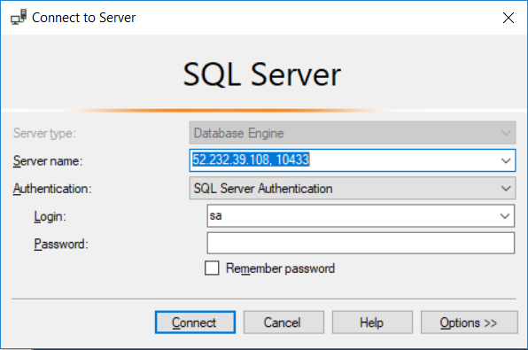
- Right click in the databases node in SSMS and click create new Database from the popup menu. Name it `ContosoFinance` and click Ok.
- With the ContosoFinance selected in SSMS click File and then open file from the menu bar, navigate to the path that the archive files were extracted and then open the `Database\Scripts\create.sql` file.
- Execute the script and confirm that the script executed succesfully and that the tables were created.
- Delete the Currently running application using the following commands
```
konstantinos@Azure:~$ kubectl delete -f contoso-finance.yaml
deployment "contoso-finance-web" deleted
service "contoso-finance-web" deleted
deployment "contoso-finance-background" deleted
konstantinos@Azure:~$ kubectl delete -f contoso-finance-api.yaml
deployment "contoso-finance-api" deleted
service "contoso-finance-api" deleted
```
- Edit the manifest files to connect to the newly created database:

**Note**: AKS is running [DNS service](https://kubernetes.io/docs/concepts/services-networking/dns-pod-service/) for all the services deployed thus we can use the service name to resolve where the SQL server container instance is currently running (no need to know IP).

**contoso-finance-api.yaml**
```
apiVersion: apps/v1beta1
kind: Deployment
metadata:
  name: contoso-finance-api
spec:
  replicas: 1
  template:
    metadata:
      labels:
        app: contoso-finance-api
    spec:
      containers:
      - name: contoso-finance-api
        image: kpantos/contoso.financial.core.api
        ports:
        - containerPort: 80
        env:
        - name: TransactionDb
          value: "Server=tcp:finance-db,10433;Initial Catalog=ContosoFinance;Persist Security Info=False;User ID=sa;Password=<YOUR PASSWORD>.;MultipleActiveResultSets=False;Connection Timeout=30;"
---
apiVersion: v1
kind: Service
metadata:
  name: contoso-finance-api
spec:
  type: LoadBalancer
  ports:
  - port: 80
  selector:
    app: contoso-finance-api
---
```

**contoso-finance.yaml**
```
apiVersion: apps/v1beta1
kind: Deployment
metadata:
  name: contoso-finance-web
spec:
  replicas: 1
  template:
    metadata:
      labels:
        app: contoso-finance-web
    spec:
      containers:
      - name: contoso-finance-web
        image: kpantos/contoso.financial.core.website
        ports:
        - containerPort: 80
        env:
        - name: IdentityConnection
          value: "Server=tcp:finance-db,10433;Initial Catalog=ContosoFinance;Persist Security Info=False;User ID=sa;Password=<YOUR PASSWORD>.;MultipleActiveResultSets=False;Connection Timeout=30;"
        - name: APIServer
          value: "REPLACE WITH THE IP YOU COPIED EARLIER"
---
apiVersion: v1
kind: Service
metadata:
  name: contoso-finance-web
spec:
  type: LoadBalancer
  ports:
  - port: 80
  selector:
    app: contoso-finance-web
---
apiVersion: apps/v1beta1
kind: Deployment
metadata:
  name: contoso-finance-background
spec:
  replicas: 1
  template:
    metadata:
      labels:
        app: contoso-finance-background
    spec:
      containers:
      - name: contoso-finance-background
        image: kpantos/contoso.financial.core.background
        env:
        - name: TransactionDb
          value: "Server=tcp:contosofinancedbserver1.database.windows.net,1433;Initial Catalog=contosofinancedb;Persist Security Info=False;User ID=azureadmin;Password=f00b@r12.;MultipleActiveResultSets=False;Connection Timeout=30;"
---
```

- Run the application using the kubectl create command specifying the manifest files as in the previous steps. Wait for the API IP, update the Website deployment APIServer IP environment variable with the new value of the API service and redeploy contoso-finance.yaml using the `kubectl create -f contoso-finance.yaml` command.

- Wait for the website service to be assigned a public IP as before. Test with the `kubectl get service contoso-finance-web` command. Once an IP has been assigned you can test the application by navigating to `http://<IP address>`. After loging in, if everyhting is working correctly you will be able to see the home screen of the Financial application and the transactions that have been issued till that time. This time though the database is hosted in the Kubernetes cluster as well.
