## Modernize .NET Core Application, Build Azure DevOps pipelines, Deploy to AKS Linux Cluster
 
## Abstract ##

## Learning Objectives ##
After completing this excerisize you will be able to:

- Containerize the eShopOnWeb E-Commerce Application
- Build and Push container images to Azure Container Registry
- Create Build and Release Definitions in VSTS
- Enable Continuous Integration and Delpoyment in VSTS
- Reference creating a AKS Cluster in Azure
- Deploy the solution using VSTS to AKS Cluster

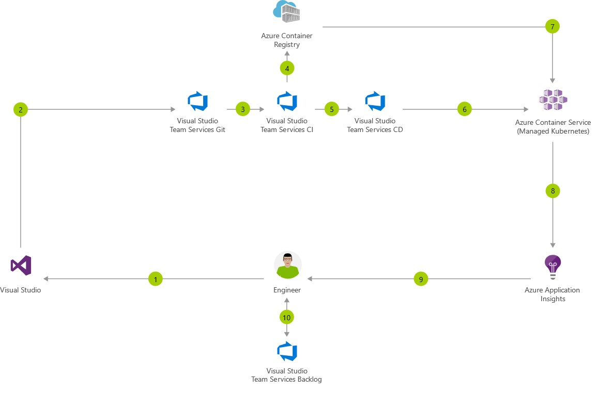

## Pre-Requisites ##
In order to complete this POC you will need:

- A **Microsoft Azure** subscription with (at least) contributor access
- Install latest version of **Visual Studio 2017 Enterprise** with following Workloads:
	- .NET desktop development
	- ASP.NET and web development
	- Azure development
	- Data storage and processing
- Download latest **SQL Server Management Studio** [here](https://docs.microsoft.com/en-us/sql/ssms/download-sql-server-management-studio-ssms)
- Install the latest version of [Azure CLI](https://docs.microsoft.com/en-us/cli/azure/install-azure-cli?view=azure-cli-latest)
- Download and install the latest **Docker Tools** from [here](https://docs.docker.com/docker-for-windows/install/)
- Download the **eShopOnWeb Project** from [here](https://demowebst.blob.core.windows.net/sharecode/eShopOnWebNetCore2.0.zip)
- Provison and deploy an AKS Cluster in Azure. [Here](https://docs.microsoft.com/en-us/azure/aks/kubernetes-walkthrough-portal) is a reference on creating AKS cluster in Azure
- Run the following command to get the credentials on your machine. These are downloaded to a config file C:\Users\yourusername\.kube\config. You will need the contents of this config file in a later step
```` CLI
az aks get-credentials --resource-group ft-akslinux-rg --name Fezk8sLinuxCluster
````

## Set up the Application Locally 
* Check in the code for eWebShop in in VSTS. You can create a separate branch other than the main branch. Below is an example:
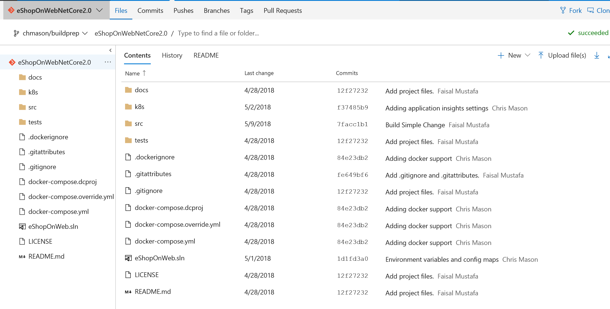
* Open eShop solution and walk through a few pieces of code
* Notice that we added the Application Insights Nuget Package
* Notice in Startup.cs ConfigureServices, this is where we add the kubernetes connection
* Create an Azure SQL DB and create two Databases, you can choose Basic Tier for your Databases
  * CatalogDB
  * IdentityDB
* In Visual Sudio Solution, navigate to the appsettings.json file. src\web\appsettings.json
* Replace lines 3 and 4 with the connection string values of your database server, username and password

```` JSON
 "CatalogConnection": "Server=tcp:YOURDBSERVERNAME.database.windows.net,1433;Initial Catalog=CatalogDB;Persist Security Info=False;User ID=YOURUSERID;Password=YOURPASSWORD;MultipleActiveResultSets=False;Encrypt=True;TrustServerCertificate=False;Connection Timeout=30;",
 "IdentityConnection": "Server=tcp:YOURDBSERVERNAME.database.windows.net,1433;Initial Catalog=IdentityDB;Persist Security Info=False;User ID=YOURUSERID;Password=YOURPASSWORD;MultipleActiveResultSets=False;Encrypt=True;TrustServerCertificate=False;Connection Timeout=30;"
````

* Run the application in Visual Studio locally. It will connect to Azure SQL and you can do some shopping on the site.

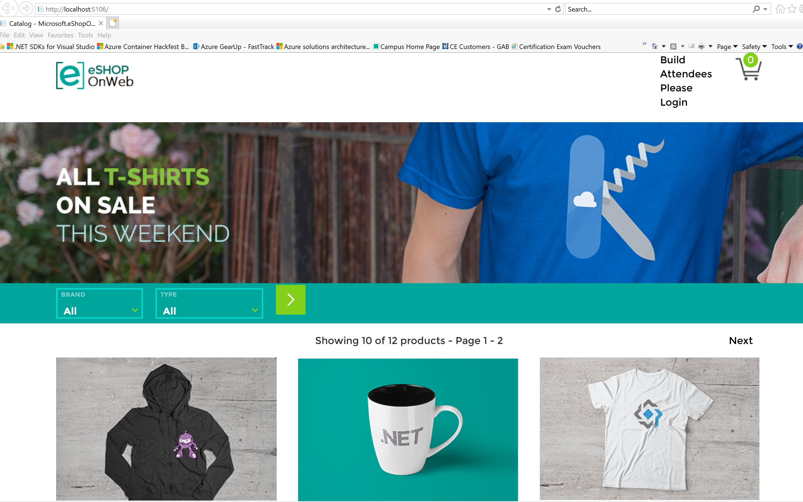
 
* Create an AppInsights instance, to keep manageable, create it in the same Resource Group as the Managed AKS cluster. Note down the **Instrumentation Key**

* Create an instance of Azure Container Registry in the Azure Portal. You may keep using the same Resource Group. [Here](https://docs.microsoft.com/en-us/azure/container-registry/) is more information on ACR
* Your provisioned AKS cluster will look similar to the one below:

## Set up Build  Definition in Azure DevOps
* Go to VSTS, create a new build
* To set up build steps, you will add two Docker tasks and one for Publish Artifact (docker build, docker push, publish k8s files)
* Your Completed build defintion with three tasks will look like this:
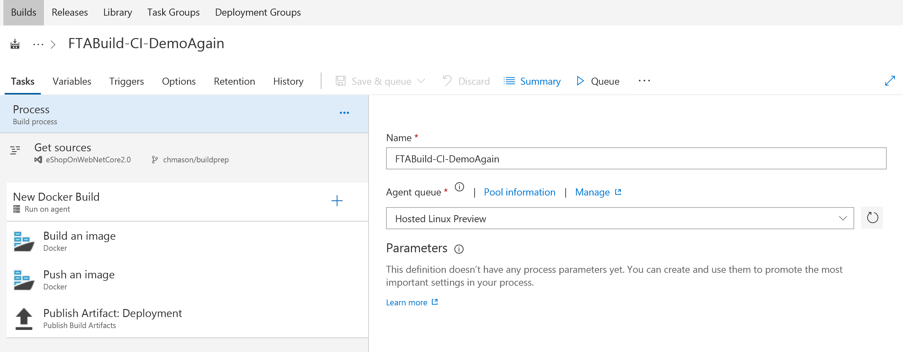
* Create a new build definition, select continue, Empty Process, ensure to use Hosted Linux Preview for Agent Queue
* **Build Image**. Search for Docker Task and add it.
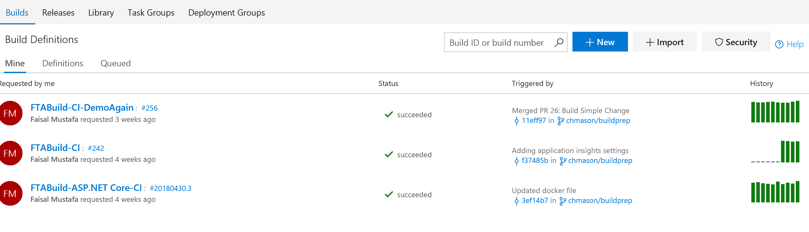
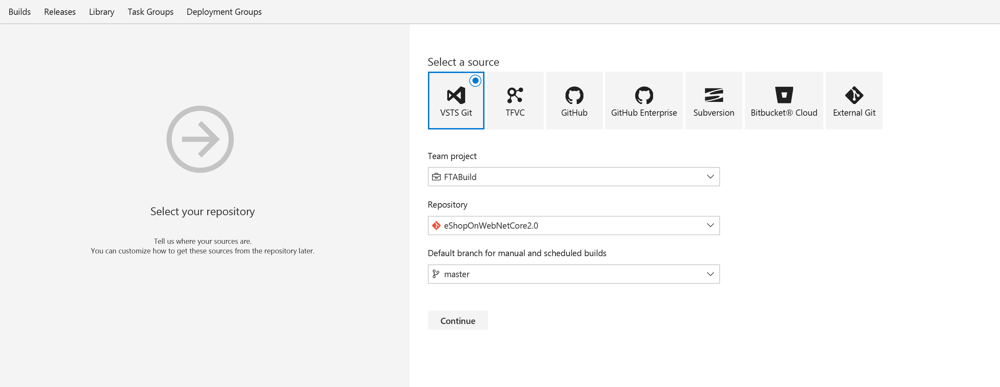

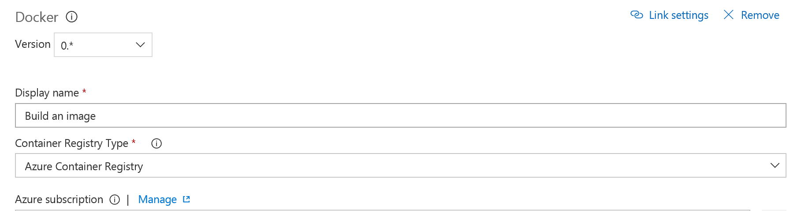
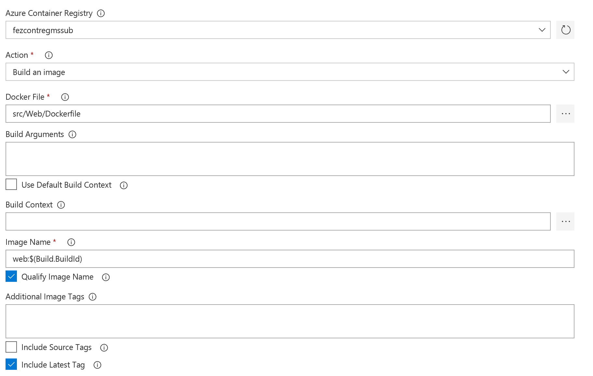

* **Push an Image**. Search for another Docker Task and add it.
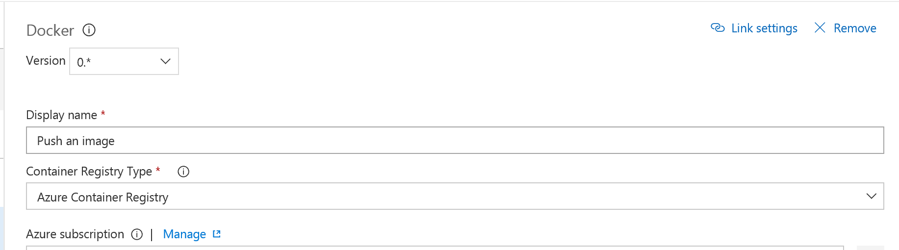
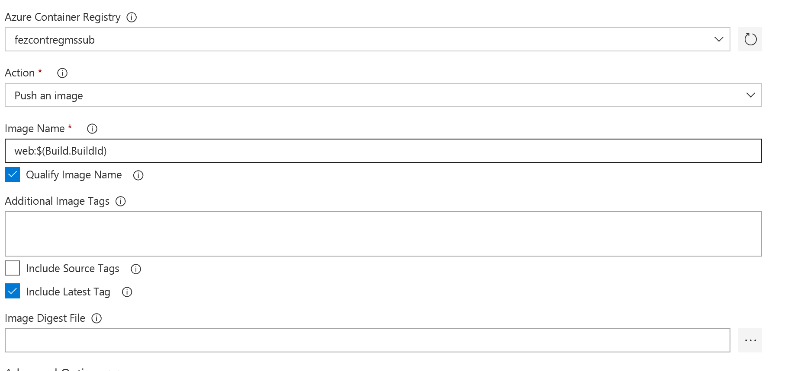


* Ensure Use Default Build Context is unchecked and leave the resulting text field blank!!
* Ensure You have your own Subscription selected and Authenticated with that subscription. Enter the rest of the fields as shown, leave rest as is. 

* Enable Continuous Integration under Triggers
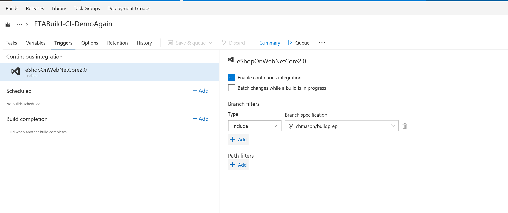
 
* Now search for Publish Artifact, and this task
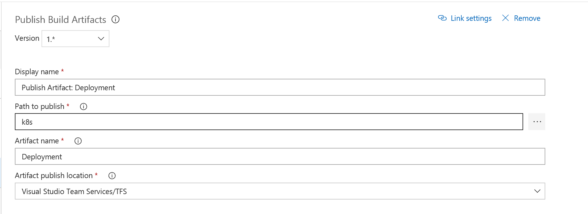

* **Kick off a build and let it finish**


## Set up Release Definition in Azure DevOps
* Create a release definition and pipeline. Once completed your definition will be similar to the one as below:

* Setup release steps (token replace, kubectl apply), use Empty Process

* Create a new artifact and point to the build definition you created
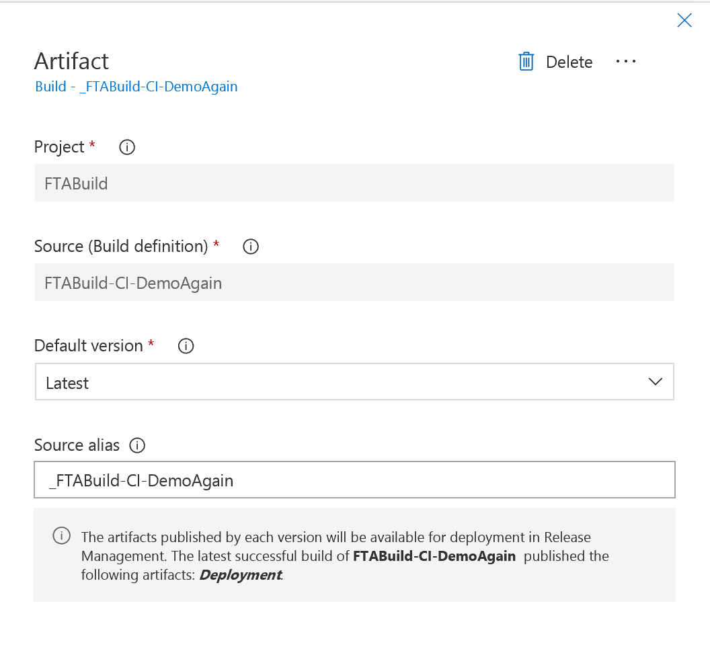
* Then create a new environment. The Environment Name used here is **AKS Cluster**.
  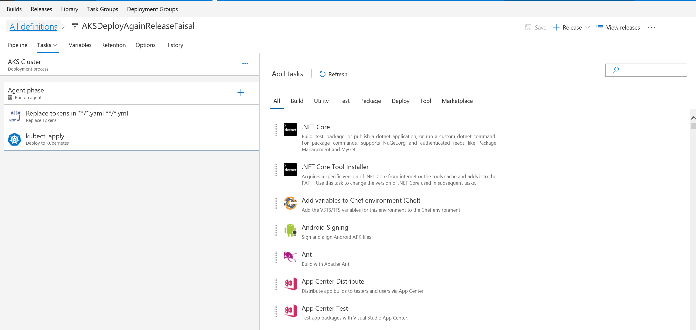
  
* Click on phase and tasks link for Environment. Add two tasks to your Environment

* For Replace Tokens - Search for Token
  * For Replace tokens: Change display name: Replace tokens in `**/*.yaml **/*.yml`
  * Change Target Files: `**/*.yaml and **/*.yml`
* Your Replace token should look similar to below. 
> **Note**: Under Token Prefix and Token Suffix, this is a **double underscore**.
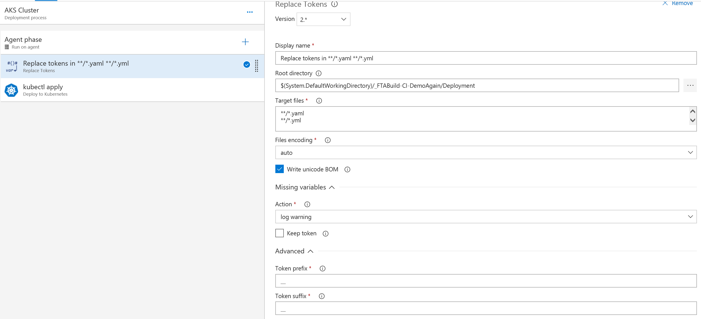
 
* **For kubectl apply** - Search for kube, you want the Deploy To Kubernetes Task, name it **kubectl apply**
* Your kubectl task  will look similar to below, replacing filled in values with yours where applicable.
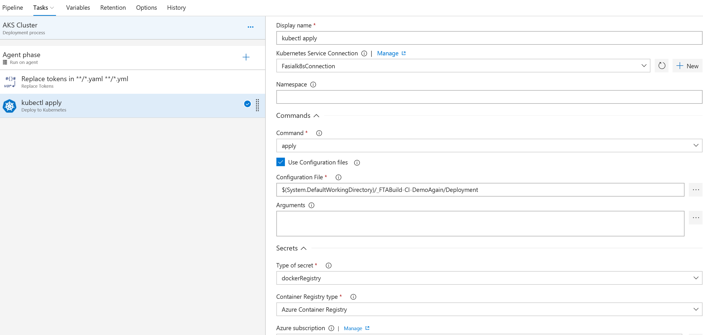

* You will be creating a New Kubernetes Service Connection. Click on **New**
  * Give this connection a Name
* URL is the API server address from Azure portal, for the AKS Cluster, under Overview. **Append http://** in front. For example: http://apiserveraddressoftheclusterfromoverviewsection
  * Copy all the contents of the **config** file under C:\Users\yourusername\.kube\ in the KubeConfig section.
  * For Azure Subscription Section, ensure you have your own subscription selected
  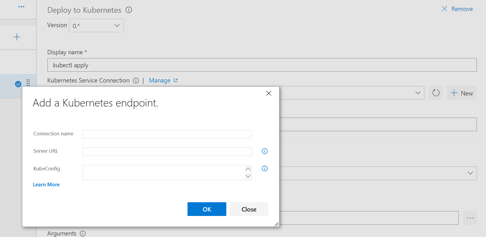

 > **Note**: This is where you set up connection to k8s cluster using the cluster config that you download by executing the get credentials command from Azure Portal. After running the get-credentials command, your **config** file is located: C:\Users\yourusername\.kube. Copy the contents of the config file to the KubeConfig field when setting up the new connection.

* Continue to fill out the rest as shown below:

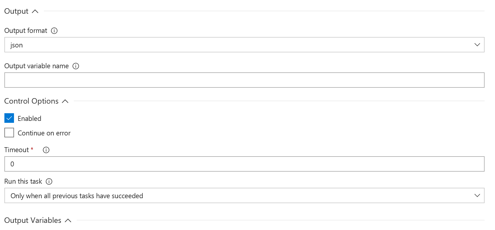
 
* Add variables and their respective values
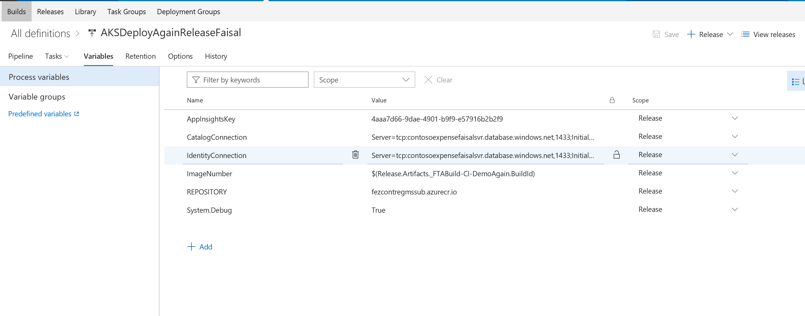

AppInsightsKey **YourValue**
 
CatalogConnection **YourValue**
 
IdentityConnection **YourValue**
 
ImageNumber **YourValue**
 
REPOSITORY **YourValue**

> **Note**: Each variable value here is what you used for your set up. ImageNumber will have the format referencing the build variable you used for your build definition. AppInsightsKey is your value for the instumentation key for Application Insights. Values you will use for CatalogConnection and IdentityConnection:
```` JSON
 "CatalogConnection": "Server=tcp:YOURDBSERVERNAME.database.windows.net,1433;Initial Catalog=CatalogDB;Persist Security Info=False;User ID=YOURUSERID;Password=YOURPASSWORD;MultipleActiveResultSets=False;Encrypt=True;TrustServerCertificate=False;Connection Timeout=30;",
 "IdentityConnection": "Server=tcp:YOURDBSERVERNAME.database.windows.net,1433;Initial Catalog=IdentityDB;Persist Security Info=False;User ID=YOURUSERID;Password=YOURPASSWORD;MultipleActiveResultSets=False;Encrypt=True;TrustServerCertificate=False;Connection Timeout=30;"
````
* Setup CD trigger
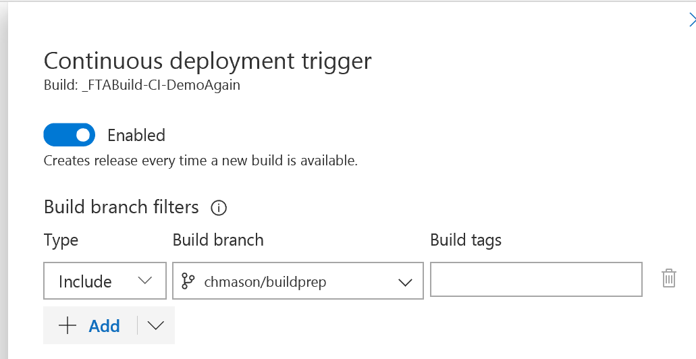

* Save all the changes and **Deploy the Release build!**

* Navigate to the application deployed on the k8s cluster. Enter command similar to below on a command prompt. This command is avaible 
from the k8s dashboard from the cluster overview blade in the Azure portal.
 ````
 az aks browse --resource-group yourresourcegroupname --name yourk8sclustername
 ````
* K8s Dashboard will launch. Note, this may take a few minutes to initialize the first time around.
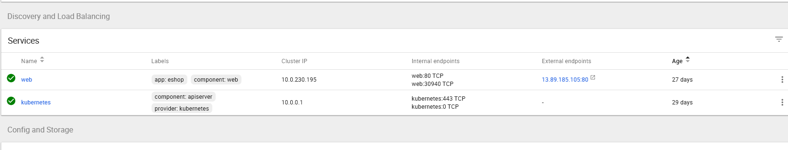

 * With a successful deploy you will be given an IP address to navigate to the site.
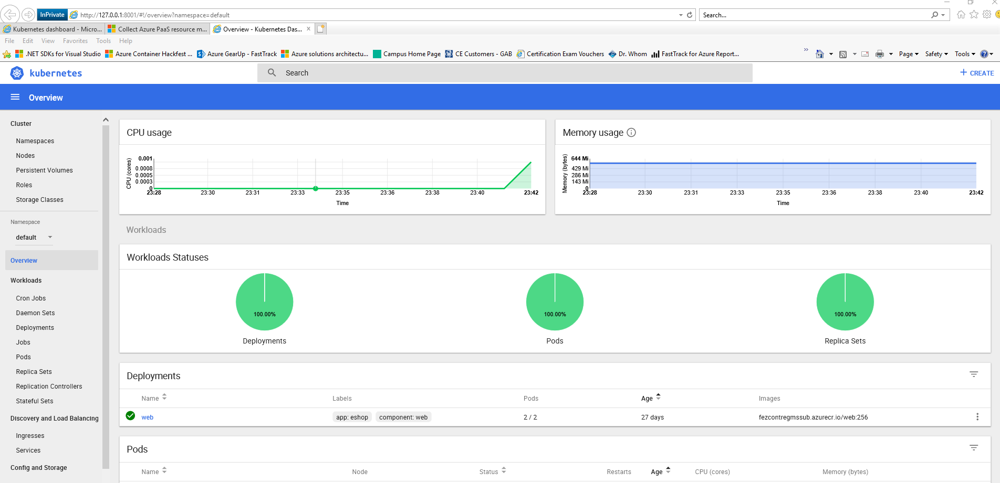

* Your website is Completely Modernized to the Cloud, running .NET Core E-Commerce Application, using VSTS, deployed to AKS Linux Cluster!!
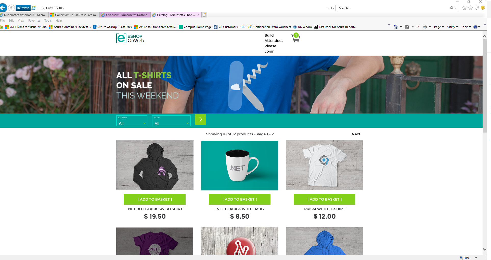

##  Application Insights set up
* Once the app is deployed click and add items to the basket, collect some telemetry. Telemetry Data will start flowing into the  Azure portal from k8s cluster!
* Go to Application Insights and configure 2 chart metrics (server requests and server response time: group by cloud role instance). Go   to the Metrics Explorer
 * Graph One, Click on Edit. 
   * Grouping on
   * Group by: Cloud Role Instance
   * Server, select Server Requests
 
 * Graph Two
   * Grouping on
   * Group by: Cloud Role Instance
   * Server, select Server Response Time
 
 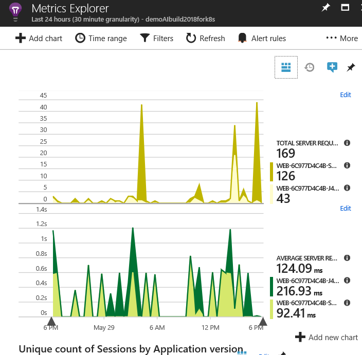
 
##  See the CI/CD Kick off a Build and Release
* Make a change in the code (e.g. change “Login” to “Sign in” or something visible)
* Commit and push.
* A build would be kicked-off/completed, the release will push the new build, and updated code is deplyed to the k8s cluster. This will take about 5 minutes.
